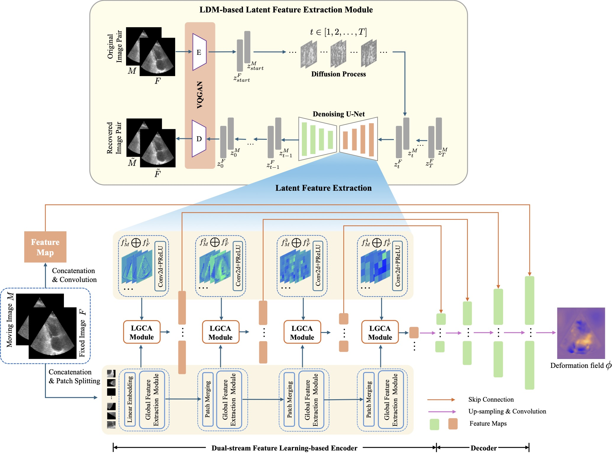

# LDM-Morph

This repository is the official implementation for the paper:  
**[LDM-Morph: Latent diffusion model guided deformable image registration](https://arxiv.org/pdf/2411.15426)**  
*Authors: Jiong Wu and Kuang Gong*

>Abstract: Deformable image registration plays an essential role in various medical image tasks. Existing deep learning-based deformable registration frameworks primarily utilize convolutional neural networks (CNNs) or Transformers to learn features to predict the deformations. However, the lack of semantic information in the learned features limits the registration performance. Furthermore, the similarity metric of the loss function is often evaluated only in the pixel space, which ignores the matching of high-level anatomical features and can lead to deformation folding. To address these issues, in this work, we proposed LDM-Morph, an unsupervised deformable registration algorithm for medical image registration. LDM-Morph integrated features extracted from the latent diffusion model (LDM) to enrich the semantic information. Additionally, a latent and global feature-based cross-attention module (LGCA) was designed to enhance the interaction of semantic information from LDM and global information from multihead self-attention operations. Finally, a hierarchical metric was proposed to evaluate the similarity of image pairs in both the original pixel space and latent feature space, enhancing topology preservation while improving registration accuracy. Extensive experiments on four public 2D cardiac image datasets show that the proposed LDM-Morph framework outperformed existing state-of-the-art CNNs- and Transformers-based registration methods regarding accuracy and topology preservation with comparable computational efficiency.


---

## Overview

<p align="center">
  
  <br>
</p>

---

## Environment
- git clone https://github.com/wujiong-hub/LDM-Morph.git
- conda create -n ldmmorph python=3.8
- conda activate ldmmorph
- pip install torch==2.1.0 torchvision==0.16.0 torchaudio==2.1.0 --index-url https://download.pytorch.org/whl/cu121
- pip install -r requirements.txt

## Datasets
- [CAMUS dataset, including two-chamber (CAMUS-2CH) and four-chamber (CAMUS-4CH) images](https://humanheart-project.creatis.insa-lyon.fr/database/#collection/6373703d73e9f0047faa1bc8)
- [EchoNet-Dynamic dataset](https://stanfordaimi.azurewebsites.net/datasets/834e1cd1-92f7-4268-9daa-d359198b310a)
- [Automated Cardiac Diagnosis Challenge (ACDC) dataset](https://humanheart-project.creatis.insa-lyon.fr/database/#collection/637218c173e9f0047faa00fb)

## Datasets preprocessing
1. Download all datasets, unzip them, and put them inside the corresponding datasets folder.
2. For the CAMUS dataset, directly run the script:
   ```python
   cd datasets/scripts/
   mkdir ../CAMUS/prep/
   python preprocess_camus.py
   ```
   For the ECHO dataset, please get the github codes of echonet from the link https://github.com/echonet/dynamic, and install its environment. Then run the script:
   ```python
   cd datasets/script/
   mkdir ../ECHO/prep/
   python preprocess_echo.py
   ```
   For the ACDC dataset, directly run the script:
   ```python
   cd datasets/script/
   mkdir ../ACDC/prep/
   python preprocess_acdc.py
   ```
## Training 
1. Train the LDM-based latent feature extraction module
   ```python
   cd datasets/script/
   mkdir ../ECHO/prep/
   python preprocess_echo.py
   ```
3. Train the registration network


